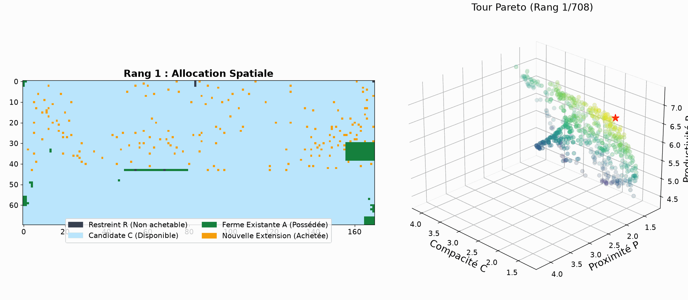
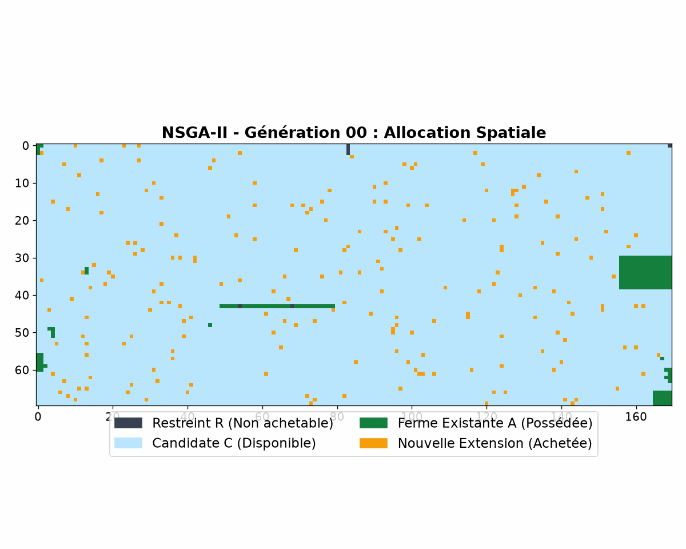
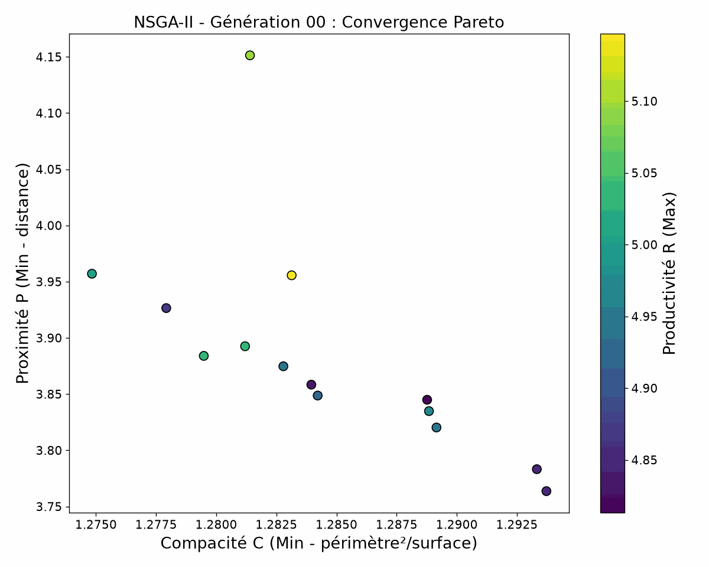
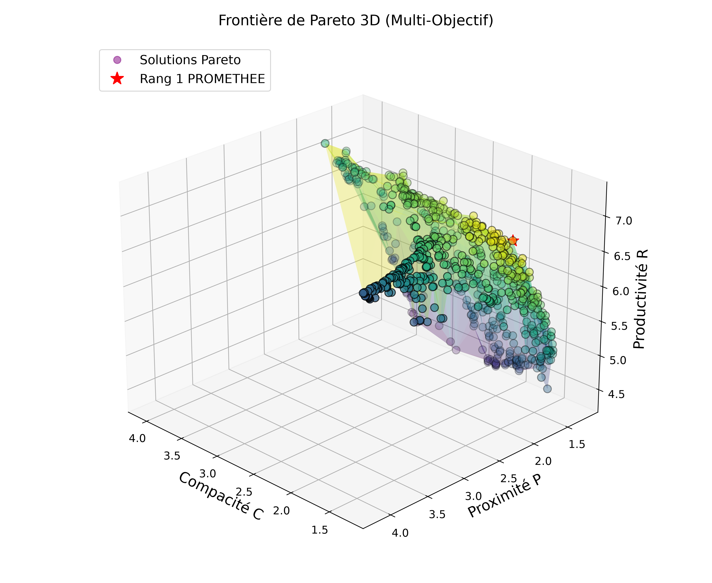

# 🌾 Optimisation Agricole Génétique (NSGA-II + PROMETHEE II)

*Lire ce document dans d'autres langues : [English 🇬🇧](README.md)*

[](https://www.python.org/downloads/)
[](LICENSE)
[](https://en.wikipedia.org/wiki/NSGA-II)
[](https://en.wikipedia.org/wiki/PROMETHEE)

Un **Framework d'Optimisation Évolutive Multi-Objectifs** haute performance pour l'expansion spatiale et l'allocation de parcelles agricoles.

Ce projet combine **NSGA-II (Non-dominated Sorting Genetic Algorithm II)** avec **PROMETHEE II (Preference Ranking Organization METHod for Enrichment Evaluations)** pour trouver les extensions spatiales de parcelles optimales respectant des contraintes strictes d'utilisation des sols et de budget.

---

## 📌 Formulation du Problème & Objectifs

L'extension agricole nécessite d'équilibrer des objectifs spatiaux et économiques souvent contradictoires sur des paysages géographiques complexes, sans pondération scalaire arbitraire :

1. **Productivité ($R_S$)** *(Maximiser)* : Maximise les rendements des cultures sur les cellules agricoles sélectionnées.
2. **Proximité ($P_S$)** *(Minimiser)* : Minimise la distance euclidienne moyenne entre les parcelles candidates et les infrastructures agricoles existantes.
3. **Compacité ($C_S$)** *(Minimiser)* : Minimise le quotient isopérimétrique ($C_S = \frac{\text{Périmètre}^2}{4 \pi \cdot \text{Surface}}$), favorisant les blocs de parcelles contigus et bien regroupés (proche de 1.0) plutôt que des "confettis" dispersés.
4. **Contrainte de Budget** : Applique un plafond budgétaire strict ($\sum \text{Coût}(cellule) \le B$) pour l'ensemble des nouvelles terres acquises.

---

## 🎯 Objectif Principal

Le but de ce projet est d'automatiser les décisions d'utilisation des sols spatiaux pour l'extension agricole :
- **Entrée** : Carte géographique d'occupation des sols, carte de productivité des sols, carte du coût d'acquisition et limite de budget.
- **Traitement** : La recherche évolutive de NSGA-II identifie les configurations non-dominées (Front de Pareto) équilibrant rendement, proximité et compacité.
- **Sortie** : Configurations d'allocation de parcelles classées (via PROMETHEE II) avec animations GIF montrant l'évolution spatiale.

---

## 🚀 Améliorations Clés & Architecture

### 1. Dominance de Pareto Multi-Critères
Les implémentations précédentes additionnaient arbitrairement les objectifs normalisés, ce qui introduisait des biais. Cette nouvelle architecture implémente une pure **Dominance de Pareto** :
* Un individu $A$ domine $B$ ($A \succ B$) si et seulement si $A$ n'est pire sur aucun objectif et strictement meilleur sur au moins un objectif.

### 2. Implémentation NSGA-II Native
* **Tri Non-Dominé Rapide (Fast Non-Dominated Sorting)** : Divise la population en fronts de Pareto ($F_1, F_2, \dots, F_k$).
* **Distance de Surpeuplement (Crowding Distance)** : Maintient la diversité le long de la frontière de Pareto.

### 3. Classement PROMETHEE II
* Évalue les solutions non-dominées du front de Pareto final pour proposer un classement basé sur les flux de préférence nets ($\Phi = \Phi^+ - \Phi^-$).

---

## 📂 Structure du Dépôt

```
genetic_agricultural_optimization/
│
├── README.md                           # Documentation en Anglais
├── README.fr.md                        # Documentation en Français
├── requirements.txt                    # Dépendances Python
│
├── data/                               # Grilles géographiques d'entrée
│
├── src/                                # Code source d'optimisation
│   ├── main.py                         # Pipeline d'exécution principal
│   └── ...                             # (algorithme génétique, évaluation, PROMETHEE II)
│
├── outputs/                            # Résultats et visualisations d'optimisation
│   ├── en/                             # Résultats localisés en anglais
│   └── fr/                             # Résultats localisés en français (GIFs, CSV, PNG)
│
└── docs/                               # Documentation supplémentaire
```

---

## 📊 Visualisations & Analyse des Sorties

Toutes les sorties générées sont sauvegardées dans le dossier `outputs/fr/`.

### 1. Exploration du Front de Pareto

*Animation : Parcourt les solutions Pareto non-dominées (classées via PROMETHEE II).*

### 2. Évolution de la Configuration Spatiale

*Animation : Exploration de l'algorithme génétique sur l'espace géographique.*

### 3. Convergence du Front de Pareto

*Animation : Convergence de la population vers la vraie frontière de Pareto.*

### 4. Surface Pareto 3D Statique


---

## ⚡ Démarrage Rapide

### 1. Prérequis
Installez les bibliothèques Python requises :
```bash
pip install -r requirements.txt
```

### 2. Exécution

Lancez le pipeline complet depuis la racine du dépôt. Vous pouvez spécifier la langue de sortie avec l'argument `--lang` (par défaut : `fr`) :

```bash
python3 src/main.py --lang fr
```

---

## 🤝 Contribution
Les contributions sont les bienvenues ! N'hésitez pas à ouvrir des issues ou soumettre des PR.
