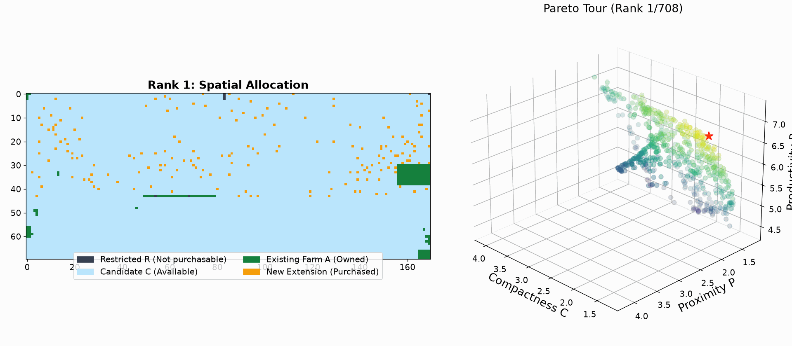
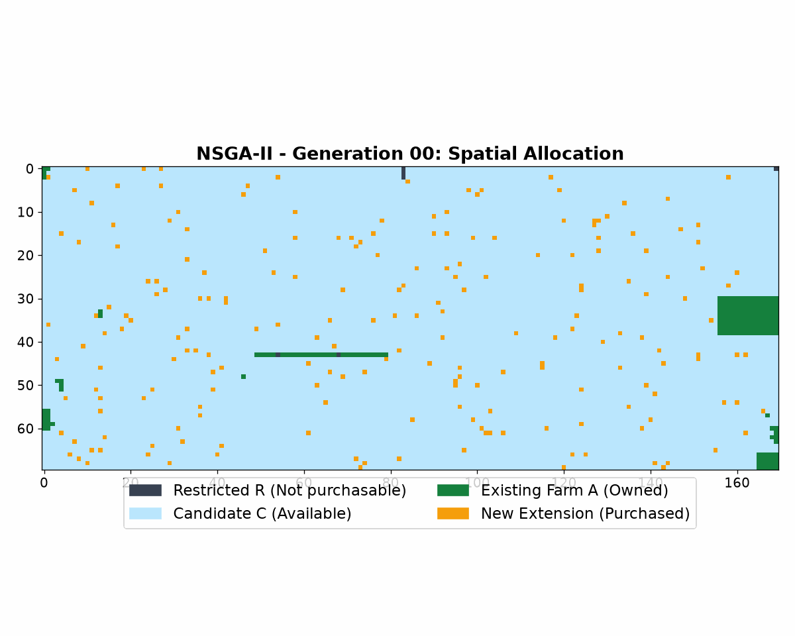
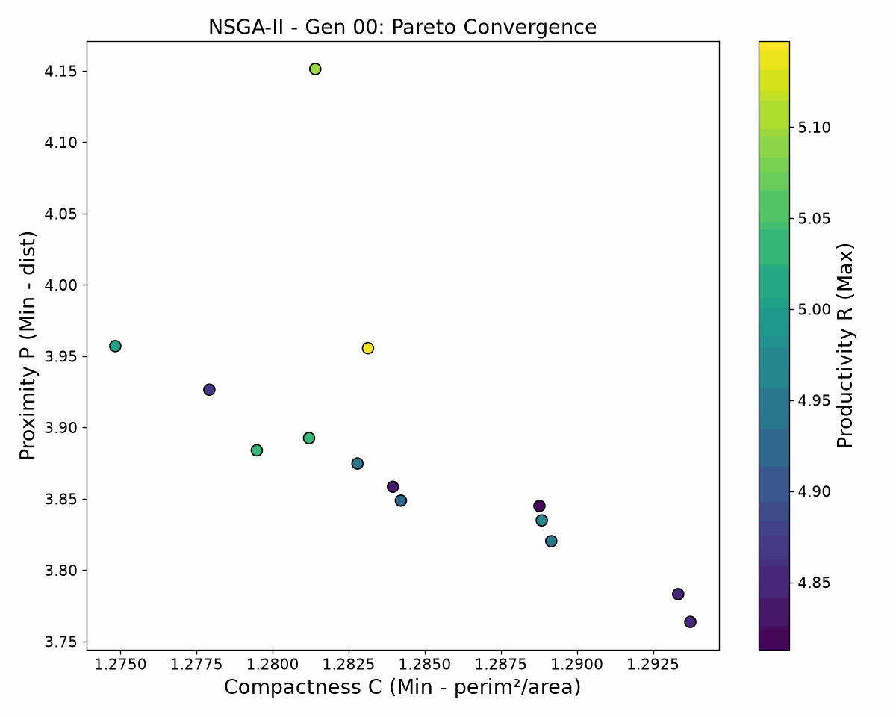
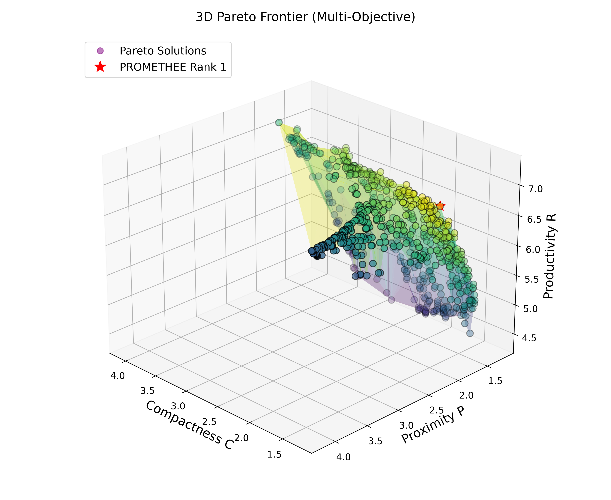

# 🌾 Genetic Agricultural Optimization (NSGA-II + PROMETHEE II)

*Read this document in other languages: [Français 🇫🇷](README.fr.md)*

[](https://www.python.org/downloads/)
[](LICENSE)
[](https://en.wikipedia.org/wiki/NSGA-II)
[](https://en.wikipedia.org/wiki/PROMETHEE)

A high-performance **Multi-Objective Evolutionary Optimization Framework** for spatial agricultural expansion and parcel allocation. 

The framework combines **NSGA-II (Non-dominated Sorting Genetic Algorithm II)** with **PROMETHEE II (Preference Ranking Organization METHod for Enrichment Evaluations)** to find optimal spatial parcel extensions respecting strict land-use and budget constraints.

---

## 📌 Problem Formulation & Objectives

Agricultural extension requires balancing competing spatial and economic goals over complex geographic landscapes without arbitrary scalar weighting:

1. **Productivity ($R_S$)** *(Maximize)*: Maximizes crop yields across selected agricultural cells based on production maps.
2. **Proximity ($P_S$)** *(Minimize)*: Minimizes average Euclidean distance from candidate parcels to existing agricultural infrastructure.
3. **Compactness ($C_S$)** *(Minimize)*: Minimizes the isoperimetric shape quotient ($C_S = \frac{\text{Perimeter}^2}{4 \pi \cdot \text{Area}}$), favoring contiguous, well-grouped parcel blocks (close to 1.0) over fragmented "confetti" shapes.
4. **Budget Constraint**: Enforces a strict budget ceiling ($\sum \text{Cost}(cell) \le B$) across all newly acquired land cells.

---

## 🎯 Core Goal

The goal of this project is to automate spatial land-use decision making for farm extension:
- **Input**: Geographic land usage map, soil productivity map, land acquisition cost map, and budget limit.
- **Process**: NSGA-II evolutionary search identifies the non-dominated Pareto-optimal land configurations balancing yield, proximity, and shape compactness.
- **Output**: Ranked land allocation configurations (via PROMETHEE II) alongside animated GIF visualizations showing spatial parcel evolution.

---

## 🚀 Key Improvements & Architecture

### 1. Multi-Fitness Pareto Dominance (Abandoning Scalar Sums)
Previous scalar implementations summed normalized objectives ($R(S) + \frac{1}{P(S)} + C(S)$), introducing bias and scaling artifacts. The new architecture implements pure **Multi-Objective Pareto Dominance**:
* **Vectorized Evaluation**: `evaluate_individual` returns raw physical objective vectors `(Compactness_C, Proximity_P, Productivity_R)`.
* **Pareto Dominance**: Individual $A$ dominates $B$ ($A \succ B$) iff $A$ is non-worse across all objectives ($C_A \le C_B, P_A \le P_B, R_A \ge R_B$) and strictly superior in at least one objective.

### 2. Native NSGA-II Implementation
* **Fast Non-Dominated Sorting**: Partitions the population into Pareto fronts ($F_1, F_2, \dots, F_k$).
* **Crowding Distance**: Computes boundary density metrics to maintain uniform diversity along the Pareto frontier.
* **Crowded Comparison Tournament**: Selects parents based on Pareto rank first, breaking ties using crowding distance.
* **Environmental Replacement ($2N \rightarrow N$)**: Selects the top $N$ individuals from combined parent and offspring populations.

### 3. Land Preprocessing & Distance Metrics
* **Spatial Preprocessing**: Computes minimum Euclidean distance matrices between candidate cultivable cells ($C$) and existing agricultural parcels ($A$).
* **Connected Component Subgrouping**: Uses Breadth-First Search (BFS) to identify contiguous parcel clusters for spatial analysis.

### 4. PROMETHEE II Preference Ranking
* Evaluates non-dominated solutions on the final Pareto front to provide a decision-maker ranking based on preference flows ($\Phi^+, \Phi^-$).

---

## 📂 Repository Structure

```
genetic_agricultural_optimization/
│
├── README.md                           # Project documentation
├── requirements.txt                    # Python dependencies
│
├── data/                               # Input geographic grid datasets
│   ├── Cost_map.txt                    # Cell acquisition cost grid data
│   ├── Production_map.txt              # Soil crop yield productivity grid data
│   └── Usage_map.txt                   # Land usage classification map (R/C/A)
│
├── src/                                # Core optimization source code
│   ├── main.py                         # Main execution pipeline
│   ├── genetic_algo.py                 # NSGA-II Multi-Objective GA engine
│   ├── evaluation.py                   # Objective evaluation & compactness formulas
│   ├── mapfunctions.py                 # BFS subgrouping & map parser
│   ├── utils.py                        # Spatial preprocessing & decision map loaders
│   ├── prometh.py                      # PROMETHEE II MCDA ranking engine
│   └── generator.py                    # Initial heuristic generators
│
├── outputs/                            # Optimization results and visualizations
│   ├── en/                             # English localized outputs
│   │   ├── pareto.csv                  # Exported Pareto-optimal solutions
│   │   ├── input_maps.png              # Visualized input geographic maps
│   │   ├── pareto_frontier_3d.png      # Visualized 3D Pareto frontier
│   │   ├── spatial_evolution.gif       # Animated spatial parcel evolution
│   │   ├── pareto_convergence.gif      # Animated Pareto frontier convergence
│   │   └── pareto_solutions_tour.gif   # Interactive 3D/2D Pareto tour
│   └── fr/                             # French localized outputs
│
└── docs/                               # Additional project documentation
    └── Projet_exploitation_agricole.pdf
```

---

## 🗺️ Understanding the Input Data

The optimization engine relies on three primary geographic grids stored in the `data/` directory:

1. **`Usage_map.txt` (Land Classification)**:
   - `A` (Agricultural): Existing farms already owned. Baseline for *Proximity*.
   - `C` (Cultivable): Available candidate land for expansion.
   - `R` (Restricted): Unusable land (urban, lakes, forests).

2. **`Cost_map.txt` (Financial Constraint)**:
   - Contains acquisition prices for each cell. The total acquisition cost cannot exceed the specified budget ceiling (e.g., 500).

3. **`Production_map.txt` (Yield Potential)**:
   - Soil fertility and expected crop yield for each cell, used to maximize *Productivity*.

---

## 🎨 Spatial Map Color Codes Legend

To make spatial land allocation intuitive, all spatial maps and animations use a standard 4-state color code:

| Color | Hex Code | State / Meaning | Description |
| :--- | :---: | :--- | :--- |
| **Dark Charcoal** | `#374151` | **Restricted ($R$)** | Lakes, forests, urban areas. Cannot be purchased. |
| **Sky Blue** | `#BAE6FD` | **Candidate ($C$)** | Available cultivable land for potential expansion. |
| **Forest Green** | `#15803D` | **Existing Farm ($A$)** | Pre-existing agricultural fields owned by the company. |
| **Gold / Orange** | `#F59E0B` | **Newly Bought Extension** | **Newly acquired candidate land selected by NSGA-II.** |

---

## 📊 Visualizations & Output Analysis

All generated outputs are saved in the `outputs/` folder.

### 1. Pareto Solutions Tour (Exploring Trade-offs)

*Animation: Cycles through non-dominated Pareto solutions (ranked via PROMETHEE II). The left panel shows the spatial 4-color parcel map (highlighting newly bought land in gold), while the right 3D panel tracks its position on the Pareto frontier. The Rank 1 solution is specially highlighted as the top compromise choice.*

### 2. Spatial Configuration Evolution (NSGA-II)

*Animation: The algorithm progressively explores land configurations across generations, converging from scattered parcels to contiguous blocks near existing fields.*

### 3. Pareto Frontier Convergence

*Animation: The population converging towards the true Pareto frontier across generations.*

### 4. Static 3D Pareto Surface & Frontier

*3D Surface Plot: Displays the smooth 3D Pareto surface mesh and non-dominated solutions along Compactness ($X$), Proximity ($Y$), and Productivity ($Z$), color-coded by PROMETHEE II net preference flows ($\Phi$).*

### 5. Interactive 3D Surface Visualization
An interactive 3D HTML plot is generated at `outputs/en/pareto_3d_interactive.html`. Open it in any web browser to rotate, zoom, and inspect exact objective values and PROMETHEE II ranks for each solution.

---

## 🔍 Solution Quality Verification

The pipeline executes an automated quality audit (`src/verify_solutions.py`) after every run:

1. **Non-Domination Audit**: Confirms 100% of solutions in `pareto.csv` strictly satisfy Pareto dominance conditions without dominated outliers.
2. **Budget Constraint Audit**: Verifies every land configuration satisfies the financial ceiling ($\sum \text{Cost}(cell) \le 500$).
3. **MCDA Ranking Audit**: Evaluates net preference flows ($\Phi = \Phi^+ - \Phi^-$) under PROMETHEE II to identify the top-ranked compromise land allocation.

---

## ⚡ Quick Start

### 1. Prerequisites
Install required Python libraries:
```bash
pip install -r requirements.txt
```

### 2. Execution

Run the complete multi-objective optimization pipeline from the repository root. You can specify the output language using the `--lang` flag (defaults to `fr`):

```bash
python3 src/main.py --lang en
```

---

## 🤝 Contributing

Contributions are welcome! Feel free to open issues or submit pull requests to enhance crossover operators, add new spatial metrics, or extend MCDA algorithms.
